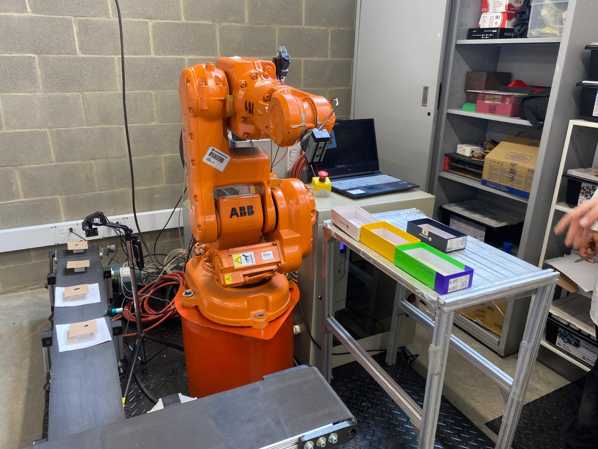
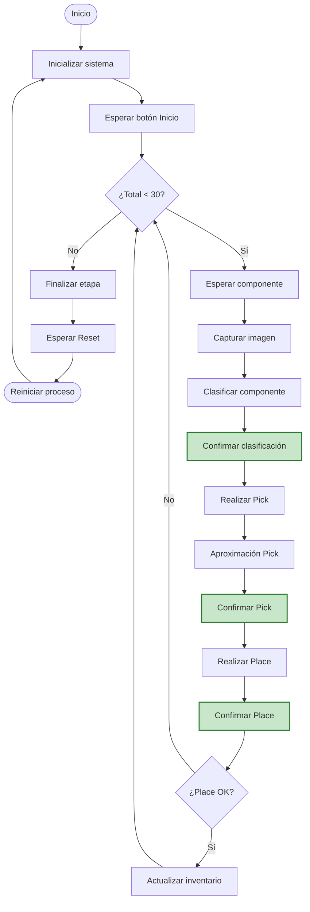
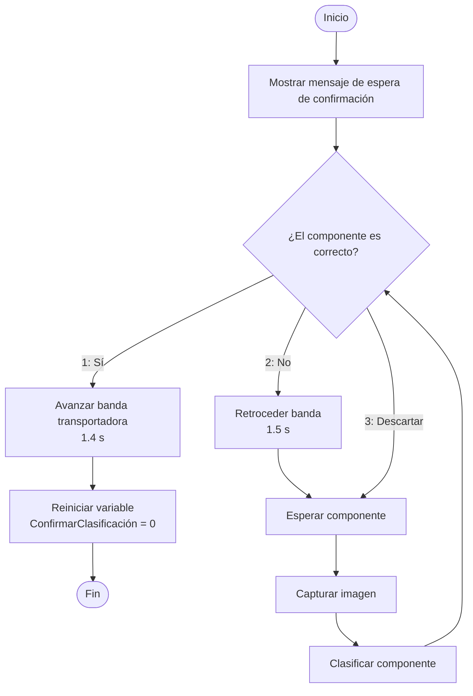
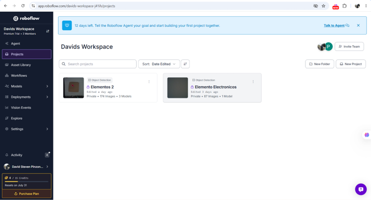
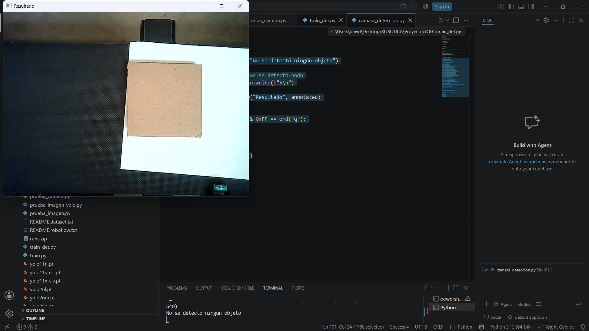
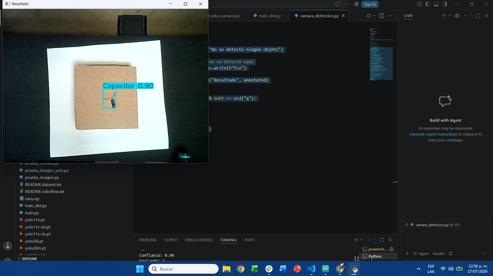
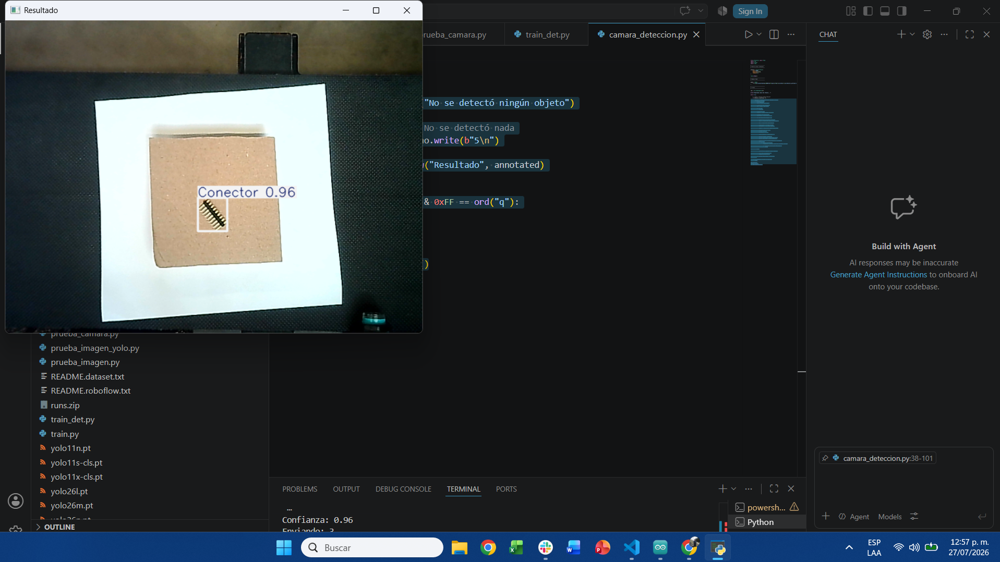
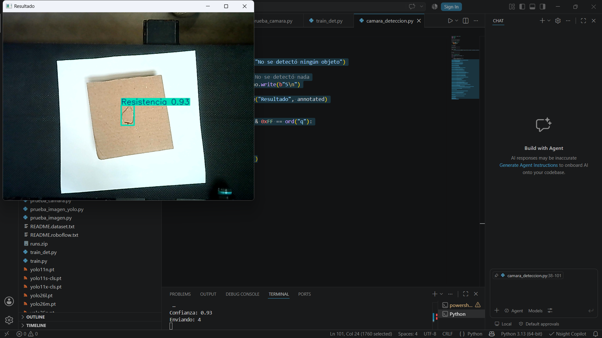
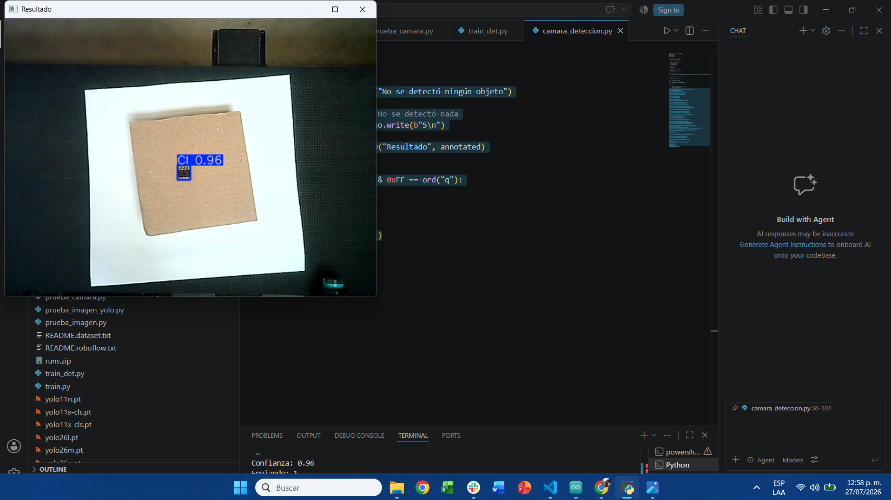
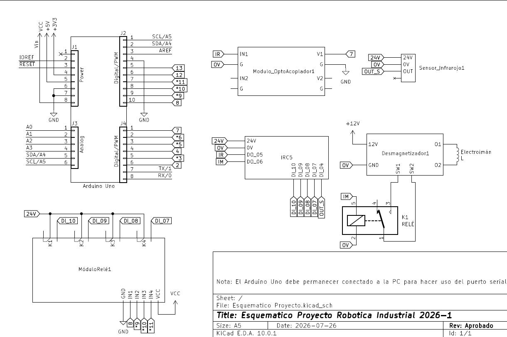

<h3>Proyecto Final - Robótica Industrial</h3>

<h1>Automatización del Proceso de Ensamblaje, Soldadura y Empaque de
PCBs.</h1>

 

<b>Figura 1. </b>

---

Proyecto para la asignatura Robótica (2016770) Universidad Nacional de Colombia

# 1. Descripción del proyecto
Recepción, clasificación y ordenamiento (ABB IRB 140 “Caín”)

Objetivo: recibir componentes en desorden desde banda, identificarlos (tipo y/o tamaño) y organizarlos en un almacén ordenado por categorías para el ensamblaje. Entrada:

Componentes mezclados llegando por banda.

Almacén vacío/semivacío con posiciones asignadas por tipo.
Secuencia mínima requerida:

1. Inicialización: home + verificación de estado seguro.
2. Detección en banda (visi´on opcional):
Detectar un componente disponible en el área de pick (posición aproximada).
(Opcional) identificar tipo con visión/clasificación simple.
3. Pick en banda: approach → pick → levantar.
4. Clasificación: decidir a qu´e zona del almac´en pertenece (por tipo de componente).
5. Place en almacén ordenado: depositar en la celda correspondiente (por ejemplo: “Resistencias”, “Capacitores”, “CI”, “Conectores”).
6. Conteo/Inventario: mantener conteo por tipo para garantizar que haya ¿= 30 componentes listos para
el Epson.
7. Fin de etapa: señal “Almacén listo” cuando se alcance el conteo requerido (según receta).

Verificación mínima:

Confirmar pick (sensor/tiempo/confirmación por operador).
 
Confirmar que el componente fue depositado en la celda correcta (por conteo o visión puntual).

Salida:
Almacén organizado con componentes clasificados y listos para ensamblaje (mínimo 30 para 1 PCB).

Fallas típicas (manejo obligatorio):

No hay componente en el área de pick → esperar/reintentar.
Pick fallido → reintentar hasta N veces y luego alarma.
Clasificación incierta → enviar a bandeja “Rechazo” o pedir confirmación en HMI.

---

# 2. Bitácora del desarrollo: decisiones, cambios, evidencias y resultados.

---

# 3. Descripción de la solución planteada.

---

# 4. Diseño del gripper/herramientas: planos + fotos + justificaci´on.

---

# 5. Diagramas de flujo del proceso

Una vez conocido el proceso a realizar, se obtiene un diagrama de flujo de las rutinas y subprocesos que deberán ser realizados para cumplir con la tarea asignada. Ya que este es un proceso extenso, se realizará también el diagrama de flujo de algunas subrutinas, estas se mostrarán en color verde en bloques del diagrama principal, mostrado a continuación.

Nota: El bloque "Esperar componente" implica que la banda transportadora está activa hasta que el sensor detecta la llegada del componente.

---

# 6. Código fuente comentado: RAPID / Python / SPEL+.
Código fuente de utilizado para el desarrollo de la práctica.
## Descripción de las funciones utilizadas.

# 7. Visión de máquina

Para poder realizar la clasificación de los cuatro objetos, hicimos uso de visión de máquina. Inicialmente, se intentó hacer uso del modelo Net8 para realizar la clasificación, haciendo uso de un dataset que se encuentra disponible en https://www.kaggle.com/datasets/julioazancort/basic-electronic-components; sin el contenedor, tantas imágenes dificultaron el entrenamiento del modelo. Adicionalmente, se presentó el problema de que este dataset contiene imágenes donde el objeto a identificar ocupa la mayoría de la misma, situación que no se presenta en nuestro escenario.
 
Por lo tanto, se optó por cambiar el tipo de detección a emplear, decidiendo así usar YOLO en modo detector para realizar el entrenamiento.

Acompañado de esto, se tomaron fotos de cada uno de los objetos ubicados en el sitio. Durante este proceso observamos que la iluminación estaba afectando la calidad de la imagen, además del contraste que se produce en la misma. Para tratar de solucionar el problema de la iluminación, se probó colocar un objeto entre la fuente de luz y el sitio donde estaba el objeto, pero esto no dio muy buenos resultados. Lo segundo que se probó fue cambiar la configuración de la cámara, bajándole el brillo y un poco el contraste. Finalmente, una solución que se encontró fue dejar debajo del objeto una superficie blanca o clara grande, para que el contraste de la cámara permita distinguir el objeto. Cabe señalar que se tomaron dos “sesiones” de fotos, ya que tras las primeras se realizaron algunos cambios, por lo que para mantener el modelo lo más fiel a lo que va a observar la cámara fue necesario volver a tomar fotos.

 
<b>Figura. Datasets empleados para el entrenamiento. </b>

Luego de tomar las fotos, se procedió a etiquetarlas, para indicar a qué objeto corresponde cada foto, además de indicar la región de la imagen donde se encuentra, esto para evitar que tome parte del fondo para reconocer el objeto. Esta tarea se realizó en la plataforma Roboflow. El primer dataset contiene en total 87 imágenes, y el segundo contiene 174 imágenes. Luego se aplica data augmentation para darle más variedad al dataset. Este dataset se descarga para luego usarlo de manera local para el entrenamiento.

Tras realizar el entrenamiento, se aplicó el modelo de visión de máquina para identificar los cuatro objetos haciendo uso de una webcam conectada por USB a la PC. En este programa, inicialmente debemos iniciar la comunicación con el puerto serial COM, en este caso COM3; esto se hace con el fin de poderse comunicar con el Arduino Uno, tema que se tratará más adelante. Luego cargamos el modelo anteriormente entrenado e iniciamos la cámara. A lo largo del programa se emiten algunos mensajes para confirmar la comunicación entre los dispositivos.

---

## Descripción de las funciones utilizadas.

### Python/YOLO

En el programa train_det.py se maneja únicamente una función, la cual a su vez hace uso de un método para realizar el entrenamiento, el cual lo ofrece Ultralytics. Este método recibe como argumentos data, epochs, imgsz, batch, workers, amp, pretrained, cache, project, name. Este método pertenece al objeto model que se crea al inicio de la función, al cual se le asigna el modelo del cual va a partir para realizar el entrenamiento, también llamado finetuning. El primer entrenamiento realizado usó YOLOv26m como punto de partida. Además, este se realizó haciendo 30 "repeticiones" o epochs, redimensionando las imágenes a 640 píxeles, procesando ocho imágenes simultáneamente por paso de entrenamiento, aceptando los pesos del modelo preentrenado y activando el entrenamiento con precisión mixta automática, la cual permite reducir el uso de la memoria de la GPU, ya que se está usando CUDA. Luego de entrenarlo, se tomó el modelo entrenado y se reentrenó usando el segundo dataset. En los anexos se puede consultar el archivo con el que se entrenó.

Para usar la detección ya con la cámara, se utiliza el programa camara_deteccion.py; este no contiene funciones propias en su código, únicamente se ejecuta de manera secuencial. En este código se encuentra un bucle while que se encarga de estar constantemente leyendo el puerto serial, esperando el mensaje “IR”; en el momento que recibe este mensaje, procede a tomar una captura de la cámara usando el método cap.read(). Tras realizar la captura, se procede a realizar el análisis con el modelo previamente cargado desde el entrenamiento. Tras usar el modelo para reconocer algún objeto, se guarda la imagen de los resultados y luego se evalúa la condición de que si se detectase algún objeto en la captura. En caso de que no, entonces se emite un mensaje indicando que no se detectó ningún objeto. En el caso contrario, entonces, del mejor resultado se extrae la clase identificada y su confiabilidad. Dado que la numeración que realiza YOLO de las clases es diferente a la numeración que recibe el Arduino para distinguir a qué clase corresponde la clase, es necesario sumarle 1 al valor que obtiene YOLO. Luego de imprimir en consola el nombre de la clase, la confianza y el número de la clase, se envía por serial al Arduino este número. Para evitar que haya problemas en la comunicación y que no reciba nuevamente el mensaje IR, se debe configurar un ciclo while que espera a recibir el mensaje “Recibido” desde el Arduino. Cuando recibe este mensaje, muestra en pantalla una imagen con la clasificación realizada, junto con su confiabilidad y con la caja envolvente.

  <table>
    <!-- Primera Fila -->
    <tr>
      <td align="center">
         
        <b>(a)</b>
      </td>
      <td align="center">
         
        <b>(b)</b>
      </td>
    </tr>
    <!-- Segunda Fila -->
    <tr>
      <td align="center">
         
        <b>(c)r</b>
      </td>
      <td align="center">
         
        <b>(d)</b>
      </td>
    </tr>
    <!-- Tercera Fila (Imagen Centrada) -->
    <tr>
      <td align="center" colspan="2">
         
        <b>(e)</b>
      </td>
    </tr>
  </table>
   
  <b>Figura . </b> Evidencias de detección: (a) Nulo, (b) Capacitor, (c) Conector, (d) Resistencia y (e) Circuito Integrado.

### Arduino

En Arduino se utilizaron las dos funciones principales, setup y loop, además de dos adicionales propias. La primera es la función detectarIR, la cual responde a una interrupción provocada por la entrada 2 nombrada con “sensorIR”. Esta función únicamente coloca en alto una bandera (“ifInf”) que luego se emplea en la función loop. La segunda función propia tiene el propósito de apagar las salidas del Arduino (8, 9, 10, 11); sin embargo, la lógica entre el Arduino y el controlador está negada, por lo que en la función se encienden todas estas salidas.

En la función loop, donde se encuentra el programa principal, se parte de revisar la bandera (“ifInf”) que indica si se le dio la orden de comunicarse con el computador para revisar la detección de objetos. Por lo tanto, si recibe esta señal, procede a enviar por serial el mensaje “IR”, que le indica a la PC que detecte y devuelva cuál es la clasificación que reconoce. Luego se queda esperando la respuesta, y al recibirla tiene un switch-case con el cual, dependiendo del mensaje que reciba, enciende (apaga por la lógica negada) una de las salidas, indicándole así al controlador del robot a cuál clase corresponde el objeto que está en la banda transportadora.

---

# 8. Plano de planta

---

# 9. Esquemático de conexiones

Para la realización del esquema, se tuvo en cuenta la conexión entre el Arduino y el controlador del manipulador, omitiendo así la conexión entre el Arduino y el computador y la cámara, ya que el Arduino únicamente se conecta con el cable USB para hacer uso del puerto serial, así como la cámara se conecta a otro puerto USB del computador.

 
<b>Figura. Esquemático del circuito utilizado en el proyecto. </b>

Para consutar el esquema con mas detelle reviser el anexo: [Esquemático](Anexos/Esquematico-v1.pdf)

---

# 10. Video de simulación

[Simulación](https://www.youtube.com/watch?v=sp3Va0xPWoQ)

---

# 11. Video de implementación física

[Implementación](https://www.youtube.com/watch?v=KdvNrrpuJQg)

---

# 12. Conclusiones

---

# Referencias
