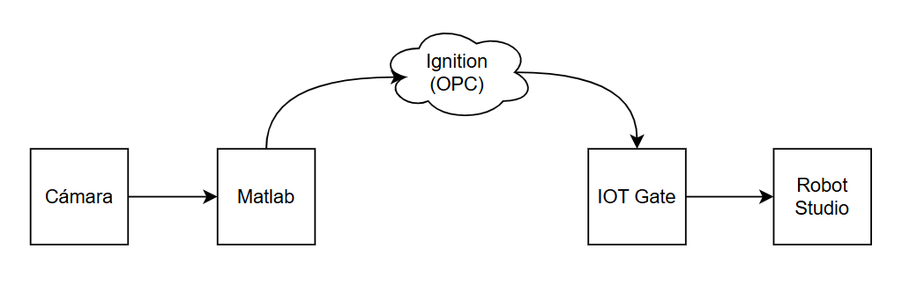
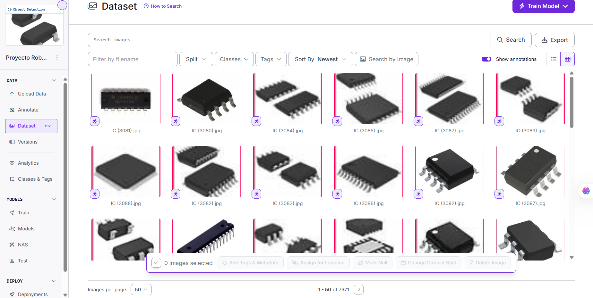
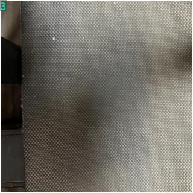
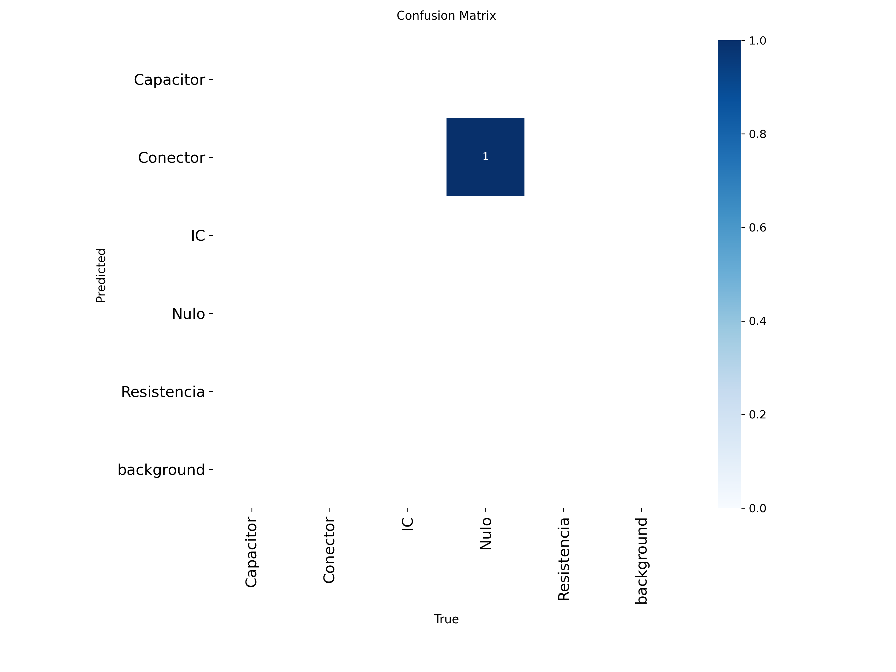
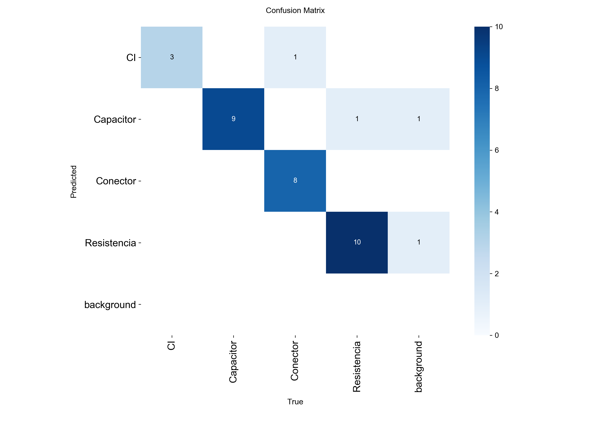

<div align="center">

<h3>Proyecto Final - Robótica Industrial</h3>

<h1>Automatización del Proceso de Ensamblaje, Soldadura y Empaque de
PCBs.</h1>

<br>

<b>Figura 1. </b>

</div>

---

Proyecto para la asignatura Robótica (2016770) Universidad Nacional de Colombia


# 1. Descripción del proyecto

## Contexto general

El proyecto tiene como objetivo general el desarrollo de una línea automatizada para el ensamblaje de circuitos impresos, PCB. Esta línea está conformada por 4 estaciones robotizadas, en donde cada una tiene un objetivo específico. De esta manera, se tienen cuatro estaciones dispuestas de manera secuencial que corresponden a la clasificación, ensamblaje, soldadura y embalaje de las placas. Cada estación es operada por un robot industrial diferente y cumple una función específica dentro del proceso de manufactura.

La presente descripción corresponde específicamente al desarrollo de la primera parte del proyecto que será desarrollada con el robot ABB IRB 140 “Caín”, el cual estará encargado de recibir componentes electrónicos transportados por una banda, clasificarlos de acuerdo con su tipo y organizarlos en un almacén estructurado para facilitar el proceso de ensamblaje realizado posteriormente por el robot Epson.

## Objetivo de la estación

La primera etapa de la línea automatizada de ensamblaje de circuitos impresos (PCB) corresponde a la recepción, clasificación y almacenamiento de componentes electrónicos mediante el robot ABB IRB 140 "Caín". El propósito de esta estación es recibir componentes que llegan de forma desordenada sobre una banda transportadora, identificarlos según su tipo o categoría y organizarlos en un almacén inicialmente vacío o parcialmente ocupado, cuyas posiciones se encuentran previamente asignadas para cada categoría de componente. Esta organización permite que la siguiente estación del proceso disponga de los componentes ordenados para realizar el ensamblaje de la PCB de manera eficiente y repetitiva.

## Secuencia general del proceso

El proceso inicia con la inicialización del sistema, donde el robot debe desplazarse a la posición de Home y verificar que se cumplen las condiciones necesarias para comenzar la operación.

Posteriormente, el sistema debe detectar la presencia de un componente en el área de recolección de la banda transportadora. De manera opcional, puede emplearse un sistema de visión para identificar el tipo o tamaño del componente antes de su manipulación.

Una vez detectado el componente, el robot ejecuta una operación de Pick, realizando una aproximación segura, la toma del componente y su posterior elevación. Con base en la clasificación obtenida, el sistema determina la categoría a la que pertenece el componente y selecciona la posición correspondiente dentro del almacén.

Finalmente, el robot realiza la operación de Place, depositando el componente en la celda asignada. Este procedimiento se repite hasta completar la cantidad de componentes requerida para abastecer la estación de ensamblaje. Durante todo el proceso, el sistema mantiene un conteo del inventario clasificado y genera una señal de finalización cuando se alcanza la cantidad establecida para la receta de producción.

## Verificaciones necesarias

Para garantizar el correcto desarrollo del proceso, la estación debe incorporar mecanismos de verificación durante las operaciones críticas. En primer lugar, se debe confirmar que la operación de Pick fue realizada exitosamente, ya sea mediante sensores, temporización o confirmación del operador. De igual manera, debe verificarse que el componente fue depositado en la posición correcta del almacén, utilizando un conteo de inventario o un sistema de visión cuando se encuentre disponible.

## Resultado

El sistema debe ser capaz de entregar un almacén organizado con los componentes clasificados por categorías y disponibles para la siguiente etapa de ensamblaje. El inventario debe contener la cantidad de componentes requerida para completar el ensamblaje de una PCB, garantizando que los elementos se encuentren correctamente distribuidos según su tipo.

## Manejo mínimo de fallas típicas

Durante la operación pueden presentarse diferentes situaciones que deben ser consideradas dentro del diseño del sistema. Entre ellas se encuentran la ausencia de componentes en el área de recolección, lo que obliga al sistema a esperar o reintentar la detección; un fallo durante la operación de Pick, que requiere realizar nuevos intentos antes de generar una condición de alarma; y una clasificación incierta del componente, caso en el cual este puede enviarse a una bandeja de rechazo o solicitar la intervención del operador mediante la interfaz HMI para confirmar la clasificación.

---

# 2. Bitácora del desarrollo: decisiones, cambios, evidencias y resultados.

## Arquitectura de comunicación

Originalmente, la idea para conseguir que el robot fuese capaz de actuar en consecuencia a un reconocimiento de objetos era usar un servidor de Ignition, la cual es una plataforma de software para automatización industrial. Este servidor permitiría conectar un modelo de visión de máquina a un IOT gateway de Robot Studio. Este modelo sería programado y ejecutado en Matlab usando imágenes propias tomadas con la cámara a utilizar en el espacio de trabajo. La intención de hacer esto era que el modelo fuese capaz de hacer la clasificación y, adicionalmente, entregar la posición del objeto respecto a la cámara para luego encontrar la posición del objeto respecto al robot.

<p align="center">

<br>
<b>Figura. Primera arquitectura planteada. </b>
</p>

Luego de tener la posición respecto al robot, el programa en RAPID que corre el controlador IRC5 recibiría esta clasificación y posición para adaptar sus movimientos con el fin de que el gripper (electroimán) recogiera el objeto en el punto exacto donde se encuentra. Evitando así otros movimientos adicionales.

Sin embargo, por cuestiones de experiencia con este tipo de implementación, y por cuestiones de tiempo, se descartó esta idea, optando por usar como método de comunicación entre el modelo y el controlador del robot un Arduino. En este nuevo escenario, lo que se busca es que cuatro salidas digitales representen cada una de las cuatro clases que debe identificar el robot. De este modo, el controlador recibirá cuatro entradas digitales que debe leer para ejecutar un procedimiento adecuado según la clase que represente cada entrada.

Por otro lado, se decidió hacer uso de Python en lugar de MATLAB, dado que ya existía una experiencia previa con su uso para este tipo de aplicación.

## Soporte cámara
## Diseño gripper
## Conexiones sistema de control y potencia
## Fuente de alimentación
## Vision de maquina

Inicialmente, se intentó hacer uso del modelo Net8 para realizar la clasificación, haciendo uso de un dataset que se encuentra disponible en [Dataset](https://www.kaggle.com/datasets/julioazancort/basic-electronic-components), el cual contiene aproximadamente 8000 imágenes, clasificadas en cinco clases: Capacitor, Dataset_Treino, IC, Resistor, Transistor. Aunque con imágenes similares el modelo detectó correctamente la clase, al probarlo con las imágenes de nuestro escenario real, realizó mal la clasificación.

<p align="center">

<br>
<b>Figura. Etiquetado del primer Dataset. </b>
</p>

En consecuencia, se intentó realizar un etiquetado para intentar usar este primer dataset con YOLO, haciendo uso de un script de Python, el cual asignó una etiqueta automáticamente según la clase. Sin embargo, tantas imágenes dificultaron el entrenamiento del modelo. Adicionalmente, se presentó el problema de que este dataset contiene imágenes donde el objeto a identificar ocupa la mayoría de la misma, situación que no se presenta en nuestro escenario. Este problema provocó que, al intentar realizar reentrenamiento del modelo "yolo11x-cls.pt", este tomase parte del fondo como información importante para reconocer la clase de la imagen. Por lo tanto, se optó por cambiar el tipo de detección a emplear, decidiendo así usar YOLO en modo detector para realizar el entrenamiento.

<div align="center">
  <table>
    <!-- Primera Fila -->
    <tr>
      <td align="center">
        <br>
        <b>(a)</b>
      </td>
      <td align="center">
        <br>
        <b>(b)</b>
      </td>
    </tr>
  </table>
  <br>
  <b>Figura . </b> Entrenamiento con yolo11x: (a) Imágen del entrenamiento y (b) Matriz de confusión.
</div>

En la imagen que se muestra arriba, se puede observar cómo el entrenamiento tomó una imagen sin ningún objeto como parte de una clase; además, en la imagen que se encuentra al lado, se observa la matriz de confusión que se genera de forma automática al usar YOLO. Esta matriz nos muestra que únicamente está reconociendo los objetos nulos, y los reconoce como conectores. Independientemente de la interpretación del resultado en particular, la conclusión principal es que no está realizando correctamente el entrenamiento. Probablemente por dos razones. La primera es por errores en el etiquetado, ya que se hizo de forma automática, y la segunda por el tipo de imagen que se está usando. 

<p align="center">

<br>
<b>Figura. Datasets empleados para el entrenamiento. </b>
</p>

Acompañado de esto, se tomaron fotos de cada uno de los objetos ubicados en el sitio. Durante este proceso observamos que la iluminación estaba afectando la calidad de la imagen, además del contraste que se produce en la misma. Para tratar de solucionar el problema de la iluminación, se probó colocar un objeto entre la fuente de luz y el sitio donde estaba el objeto, pero esto no dio muy buenos resultados. Lo segundo que se probó fue cambiar la configuración de la cámara, bajándole el brillo y un poco el contraste. Finalmente, una solución que se encontró fue dejar debajo del objeto una superficie blanca o clara grande, para que el contraste de la cámara permita distinguir el objeto.

## Detección de componente

---

# 3. Descripción de la solución planteada.

---

# 4. Diseño del gripper/herramientas: planos + fotos + justificaci´on.

---

# 5. Diagramas de flujo del proceso

Una vez definido el funcionamiento del sistema, se presentan los diagramas de flujo correspondientes a las rutinas y subprocesos que conforman el proceso de clasificación y almacenamiento de componentes. Debido a que el programa está estructurado de forma modular y contiene diversos procedimientos, además del diagrama de flujo principal se incluyen los diagramas de las subrutinas más relevantes para facilitar la comprensión de la lógica implementada. En el diagrama principal, dichas subrutinas se resaltan mediante bloques de color verde.

Nota: En el bloque "Esperar componente" se considera que la banda transportadora permanece en funcionamiento hasta que el sensor detecta la llegada de un componente, momento en el cual la banda se detiene para continuar con el proceso.


## Subrutina de clasificación


## Subrutina de pick


## Subrutina de interrupción

Además, se agrega una parada de emergencia por software. Esta rutina es agregada como una interrupción, lo que permitirá parar al manipulador en el momento que sea necesario, imponiéndose sobre el código que se esté ejecutando.


Sin embargo, es importante mencionar que esta parada de emergencia por software no es ideal, ni comparable, con respecto a las paradas de emergencia físicas. En este caso, la interrupción funciona al terminar la línea de código que se está ejecutando, por lo tanto, su parada no es completamente instantánea, lo que podría suponer un riesgo para el entorno a nivel general o el personal que esté alrededor del manipulador. Además, tener que utilizar un botón adicional en la interfaz no es tan práctico y alcanzable como el botón de parada de emergencia físico, ya que supone un paso adicional e incluso que puede no llegar a ejecutarse por algún error o desviación al tocar el botón en la pantalla. Todas estas razones suponen una gran desventaja a la parada de emergencia por software frente a los botones físicos.

---
# 6.Código RAPID – Módulo de Clasificación y Almacenamiento de Componentes

Código fuente utilizado para el desarrollo de la práctica. El programa fue escrito en RAPID y se ejecuta en el controlador IRC5 del robot ABB IRB 140 "Caín". Está organizado en un único módulo (`Module1`) que agrupa la declaración de variables y un conjunto de procedimientos, cada uno responsable de una parte concreta del proceso de recepción, clasificación y almacenamiento de componentes.

El archivo completo y comentado puede consultarse en [`Module1_Proyecto_Etapa1.txt`](./Anexos/Module1_Proyecto_Etapa1.txt). A continuación se describen las partes más relevantes del código junto con los fragmentos correspondientes.

## Variables de posición, herramienta y sistemas de coordenadas

El módulo define un conjunto de `robtarget` que representan los puntos de paso del robot en dos zonas de trabajo: la zona de la banda transportadora (donde ocurre el Pick) y la zona del almacén (donde ocurre el Place). Cada celda del almacén está representada por un par de posiciones: una de aproximación y una de depósito.

```
CONST robtarget Target_36:=[[30,30,-50],[1,0,0,0],[-2,0,-1,0],[9E+09,9E+09,9E+09,9E+09,9E+09,9E+09]];
CONST robtarget Target_35:=[[30,30,-798.16],[1,0,0,0],[-2,0,-1,0],[9E+09,9E+09,9E+09,9E+09,9E+09,9E+09]];
CONST robtarget Target_30:=[[30.000146555,30.000033692,-11.381966907],[0.996910434,0.002545816,-0.069559583,0.036394646],[-2,-1,0,0],[9E+09,9E+09,9E+09,9E+09,9E+09,9E+09]];
```

Para trabajar con coordenadas simples en cada zona, se definen dos sistemas de coordenadas de trabajo (`wobjdata`): `Workobject_9` sobre la banda y `Workobject_13` sobre el almacén. También se define la herramienta `MyNewToolEI`, correspondiente al electroimán montado en el efector final, especificando su punto central de herramienta (TCP) y su carga.

```
PERS tooldata MyNewToolEI:=[TRUE,[[0.05,0,41.6],[1,0,0,0]],[1,[0,0,1],[1,0,0,0],0,0,0]];
TASK PERS wobjdata Workobject_9:=[FALSE,TRUE,"",[[340.64,-9.06,-420.092],[1,0,0,0]],[[-410,-593.41,264],[0,0.707106781,0.707106781,0]]];
TASK PERS wobjdata Workobject_13:=[FALSE,TRUE,"",[[50,0,-404],[1,0,0,0]],[[600,721,702],[0,-0.707106781,0.707106781,0]]];
```

## Variables de estado, contadores y comunicación con la HMI

El proceso se apoya en variables persistentes (`PERS`) para que su valor sea visible en todo momento por la interfaz HMI y se conserve entre ciclos. Entre ellas están los contadores de inventario por tipo de componente, el estado general del proceso, el tipo de componente detectado, y un grupo de variables de confirmación (`ConfirmarClasificacion`, `ConfirmarPick`, `ConfirmarPlace`) que funcionan como semáforos entre el robot y el operador: el programa se detiene en un `WaitUntil` hasta que la HMI escribe en ellas un valor distinto de cero.

```
PERS num ContRes:=0;
PERS num ContCap:=0;
PERS num ContCon:=0;
PERS num ContCI:=0;
PERS num Total:=0;

PERS num Estado:=99;
PERS num Tipo:=4;

PERS num ConfirmarClasificacion:=0;
PERS num ConfirmarPick:=0;
PERS num ConfirmarPlace:=0;
PERS bool PlaceOK:=FALSE;
```

## Programa principal (`main`)

La rutina `main` conecta la interrupción de emergencia a la señal digital correspondiente y luego organiza el proceso en dos bucles anidados: uno externo que representa un lote completo (un almacén), y uno interno que se repite una vez por cada componente hasta alcanzar la cantidad definida. Dentro del bucle interno se invoca, en orden, cada etapa del ciclo de un componente: detección, clasificación, confirmación, Pick, confirmación de Pick, Place y confirmación de Place.

```
PROC main()

    CONNECT IntSalida WITH RevisarEmergencia;
    ISignalDO DO_01,1,IntSalida;

    WHILE TRUE DO

        InicializarSistema;
        EsperarInicio;

        WHILE Total<2 DO

            EsperarComponente;
            CapturarImagen;
            ClasificarComponente;
            ConfirmarClasificacionProc;
            RealizarPick;
            Realizaraproxpick;
            ConfirmarPickProc;
            RealizarPlace;
            ConfirmarPlaceProc;

            IF PlaceOK THEN
                ActualizarInventario;
            ENDIF

        ENDWHILE

        FinEtapa;

    ENDWHILE

ENDPROC
```

## Inicialización y manejo de la parada de emergencia

`InicializarSistema` deja el proceso en un estado conocido al inicio de cada lote: reinicia contadores, banderas y botones de la HMI, apaga los actuadores (banda y electroimán) y envía el robot a Home. La parada de emergencia por software se implementa como una interrupción (`TRAP`), lo que permite que, sin importar la instrucción que se esté ejecutando, una activación de la señal asociada desvíe inmediatamente el flujo del programa hacia `RevisarEmergencia`, apague los actuadores y deje el sistema esperando confirmación del operador para reanudar.

```
TRAP RevisarEmergencia

    MensajeEstado:="PARADA DE SOFTWARE, oprima inicio para continuar";

    Reset DO_01;
    Reset DO_05;
    Set DO_06;

    Reset FWD_Conveyor;
    Reset BWD_Conveyor;

    Estado:=99;

    WaitUntil BtnInicio;
    BtnInicio:=FALSE;

    MensajeEstado:="Reanudando proceso";

ENDTRAP
```

## Recepción, captura y clasificación del componente

Estas tres rutinas implementan la entrada de la estación. `EsperarComponente` enciende la banda y espera al sensor de presencia (`DI_04`); `CapturarImagen` dispara la cámara mediante un pulso en `DO_05` y da tiempo al sistema de visión para procesar la imagen; `ClasificarComponente` traduce el resultado del sistema de visión, leído en cuatro entradas digitales (una por categoría), a la variable `Tipo`.

```
PROC ClasificarComponente()

    Estado:=2;

    IF DI_07=0 AND DI_08=0 AND DI_09=0 AND DI_10=0 THEN
        Tipo:=0;
        Ninguno:=1;
        MensajeEstado:="Tipo: No identificado";
    ENDIF

    IF DI_07=1 THEN
        Tipo:=1;
        MensajeEstado:="Tipo: Resistencia";
    ENDIF

    IF DI_08=1 THEN
        Tipo:=2;
        MensajeEstado:="Tipo: Capacitor";
    ENDIF

    IF DI_09=1 THEN
        Tipo:=3;
        MensajeEstado:="Tipo: Conector";
    ENDIF

    IF DI_10=1 THEN
        Tipo:=4;
        MensajeEstado:="Tipo: Circuito integrado";
    ENDIF

    WaitTime 3;

ENDPROC
```

## Confirmación de clasificación

Esta rutina implementa la verificación mínima exigida antes de tomar el componente: el programa espera a que el operador confirme desde la HMI si la clasificación fue correcta. Según la respuesta, se ejecuta una de tres rutas: continuar con normalidad (`CASE 1`), retroceder el componente en la banda y repetir todo el ciclo de detección y clasificación (`CASE 2`), o descartar el componente y pasar directamente a esperar uno nuevo (`CASE 3`). Los casos 2 y 3 se resuelven mediante una llamada recursiva a la misma rutina, de modo que el programa no continúa hasta obtener una clasificación aceptada.

```
PROC ConfirmarClasificacionProc()

    MensajeEstado:="Esperando confirmación de selección";

    WaitUntil ConfirmarClasificacion<>0;

    TEST ConfirmarClasificacion

    CASE 1:
        Set FWD_Conveyor;
        Set BWD_Conveyor;
        WaitTime 1.5;
        Reset FWD_Conveyor;
        Reset BWD_Conveyor;

    CASE 2:
        Ninguno:=0;
        ConfirmarClasificacion:=0;
        Set BWD_Conveyor;
        WaitTime 3;
        Reset BWD_Conveyor;

        EsperarComponente;
        CapturarImagen;
        ClasificarComponente;
        ConfirmarClasificacionProc;

    CASE 3:
        Ninguno:=0;
        ConfirmarClasificacion:=0;

        EsperarComponente;
        CapturarImagen;
        ClasificarComponente;
        ConfirmarClasificacionProc;

    ENDTEST

    ConfirmarClasificacion:=0;

ENDPROC
```

## Operación de Pick y su verificación

El Pick se divide en dos movimientos independientes: `RealizarPick` lleva el robot a la posición de aproximación sobre el componente y libera el electroimán, mientras que `Realizaraproxpick` ejecuta el descenso final, la sujeción y el levantamiento de la pieza. `ConfirmarPickProc` implementa la verificación mínima del Pick: si el operador indica que la toma falló, se reintenta solo el movimiento de aproximación; si indica que el componente debe rechazarse, el ciclo completo (detección, clasificación y Pick) se repite desde el inicio.

```
PROC ConfirmarPickProc()

    MensajeEstado:="Esperando confirmación de PICK";

    WaitUntil ConfirmarPick<>0;

    TEST ConfirmarPick

    CASE 1:
        MensajeEstado:="PICK confirmado";

    CASE 2:
        ConfirmarPick:=0;
        MensajeEstado:="Reintentando PICK";
        Realizaraproxpick;
        ConfirmarPickProc;

    CASE 3:
        ConfirmarPick:=0;
        MensajeEstado:="Componente rechazado";

        EsperarComponente;
        CapturarImagen;
        ClasificarComponente;
        ConfirmarClasificacionProc;
        RealizarPick;
        Realizaraproxpick;
        ConfirmarPickProc;

    ENDTEST

    ConfirmarPick:=0;

ENDPROC
```

## Operación de Place, su verificación y actualización del inventario

`RealizarPlace` selecciona la trayectoria de depósito correspondiente a la celda del almacén según el `Tipo` de componente. `ConfirmarPlaceProc` implementa la verificación mínima del Place, marcando `PlaceOK` en `TRUE` o `FALSE` según la confirmación del operador; esta bandera es la que usa `main()` para decidir si el componente se contabiliza. `ActualizarInventario` incrementa el contador correspondiente al tipo almacenado y el contador global `Total`, que controla el bucle principal y alimenta el indicador de progreso de la HMI.

```
PROC RealizarPlace()

    TEST Tipo

    CASE 1:
        MensajeEstado:="Almacenando resistencia";
        Path_12;

    CASE 2:
        MensajeEstado:="Almacenando capacitor";
        Path_13;

    CASE 3:
        MensajeEstado:="Almacenando conector";
        Path_14;

    CASE 4:
        MensajeEstado:="Almacenando CI";
        Path_15;

    ENDTEST

ENDPROC
```

```
PROC ActualizarInventario()

    MensajeEstado:="Almacén actualizado";

    TEST Tipo

    CASE 1:
        ContRes:=ContRes+1;

    CASE 2:
        ContCap:=ContCap+1;

    CASE 3:
        ContCon:=ContCon+1;

    CASE 4:
        ContCI:=ContCI+1;

    ENDTEST

    Total:=Total+1;
    Progreso:=Total;

ENDPROC
```

## Fin de etapa

Cuando el contador `Total` alcanza la cantidad requerida, `FinEtapa` apaga los actuadores, notifica al operador que el almacén está listo y detiene el proceso hasta que se presiona el botón de reinicio en la HMI, momento en el cual `main()` vuelve a llamar a `InicializarSistema` para comenzar un nuevo lote.

```
PROC FinEtapa()

    Estado:=4;
    FIN:=1;

    Reset DO_01;
    Reset DO_05;
    Set DO_06;
    Reset FWD_Conveyor;
    Reset BWD_Conveyor;

    MensajeEstado:="¡Almacén listo!";
    WaitTime 3;

    MensajeEstado:="Esperando Nuevo almacén ...";
    WaitUntil BtnReset;
    BtnReset:=FALSE;

ENDPROC
```

## Trayectorias del robot (`Path_10` a `Path_15`)

Las rutinas `Path_10` a `Path_15` contienen únicamente instrucciones de movimiento (`MoveJ`, `MoveL`) y son las que ejecutan físicamente el desplazamiento del robot. `Path_10` lleva el robot a Home; `Path_11` y `Path_11_1` realizan la aproximación y la toma del componente sobre la banda; `Path_12` a `Path_15` llevan el componente ya sujetado hasta la celda del almacén correspondiente a su tipo (resistencias, capacitores, conectores y circuitos integrados, respectivamente), activan el electroimán en reversa para soltar la pieza y retiran el robot de la celda.

```
PROC Path_12()
    MoveL Target_35,v30,z10,MyNewToolEI\WObj:=Workobject_9;
    MoveJ Target_Home,v100,z10,MyNewToolEI\WObj:=wobj0;
    MoveJ Target_39,v100,z10,MyNewToolEI\WObj:=Workobject_13;
    MoveL Target_40,v30,z10,MyNewToolEI\WObj:=Workobject_13;
    Set DO_06;
    WaitTime 6;
    MoveJ Target_39,v30,z10,MyNewToolEI\WObj:=Workobject_13;
ENDPROC
```

Las rutinas `Path_13`, `Path_14` y `Path_15` siguen exactamente la misma estructura que `Path_12`, cambiando únicamente el par de posiciones de destino (`Target_49/50`, `Target_59/60` y `Target_69/70` respectivamente), ya que corresponden a la misma lógica de depósito aplicada a una celda distinta del almacén.

## Descripción de las funciones utilizadas.

| Procedimiento | Función dentro del proceso |
|---|---|
| `main` | Orquesta el ciclo completo: inicialización, espera de inicio y el bucle de recepción-clasificación-almacenamiento por componente. |
| `InicializarSistema` | Restablece variables, contadores y actuadores al inicio de cada lote. |
| `EsperarInicio` | Detiene el proceso hasta que el operador presiona Start. |
| `RevisarEmergencia` (TRAP) | Atiende la parada de emergencia por software en cualquier punto del programa. |
| `EsperarComponente` | Controla la banda hasta detectar un componente disponible para el Pick. |
| `CapturarImagen` | Dispara la cámara y espera el procesamiento del sistema de visión. |
| `ClasificarComponente` | Traduce las señales del sistema de visión a la variable `Tipo`. |
| `ConfirmarClasificacionProc` | Verificación mínima de clasificación, con reintento o descarte según respuesta del operador. |
| `RealizarPick` / `Realizaraproxpick` | Ejecutan la aproximación y la toma física del componente. |
| `ConfirmarPickProc` | Verificación mínima del Pick, con reintento o rechazo del componente. |
| `RealizarPlace` | Selecciona la celda de destino según el tipo de componente. |
| `ConfirmarPlaceProc` | Verificación mínima del Place y actualización de la bandera `PlaceOK`. |
| `ActualizarInventario` | Incrementa los contadores de inventario por tipo y el total del lote. |
| `FinEtapa` | Cierra el lote, apaga actuadores y espera el reinicio del operador. |
| `Path_10` a `Path_15` | Trayectorias físicas de movimiento del robot entre Home, banda y celdas del almacén. |


# 7. Visión de máquina

Para poder realizar la clasificación de los cuatro objetos, hicimos uso de visión de máquina. Como se mencionó con anterioridad, se seleccionó hacer uso de YOLO para cumplir esta función. Para poder implementarlo, fue necesario descargar la librería de Ultralytics que contiene el modelo YOLO, haciendo uso del comando "pip install ultralytics". Tras esto, se procedió a tomar las fotos necesarias para entrenar el modelo de visión de máquina. Cabe señalar que se tomaron dos “sesiones” de fotos, ya que tras las primeras se realizaron algunos cambios, por lo que para mantener el modelo lo más fiel a lo que va a observar la cámara fue necesario volver a tomar fotos. Además, la primera "sesión" fue tomada con un celular, por lo que la calidad de la imagen es diferente a la de la webcam que se terminó usando.

<p align="center">

<br>
<b>Figura. Datasets empleados para el entrenamiento. </b>
</p>

Luego de tomar las fotos, se procedió a etiquetarlas, para indicar a qué objeto corresponde cada foto, además de indicar la región de la imagen donde se encuentra, esto para evitar que tome parte del fondo para reconocer el objeto. Esta tarea se realizó en la plataforma Roboflow. El primer dataset contiene en total 87 imágenes, y el segundo contiene 174 imágenes. Luego se aplica data augmentation para darle más variedad al dataset. Este dataset se descarga para luego usarlo de manera local para el entrenamiento.

Tras realizar el entrenamiento, se aplicó el modelo de visión de máquina para identificar los cuatro objetos haciendo uso de una webcam conectada por USB a la PC. En este programa, inicialmente debemos iniciar la comunicación con el puerto serial COM, en este caso COM3; esto se hace con el fin de poderse comunicar con el Arduino Uno, tema que se tratará más adelante. Luego cargamos el modelo anteriormente entrenado e iniciamos la cámara. A lo largo del programa se emiten algunos mensajes para confirmar la comunicación entre los dispositivos.

---

## Descripción de las funciones utilizadas.

### Python/YOLO

En el programa train_det.py se maneja únicamente una función, la cual a su vez hace uso de un método para realizar el entrenamiento, el cual lo ofrece Ultralytics. Este método recibe como argumentos data, epochs, imgsz, batch, workers, amp, pretrained, cache, project, name. Este método pertenece al objeto model que se crea al inicio de la función, al cual se le asigna el modelo del cual va a partir para realizar el entrenamiento, también llamado finetuning. El primer entrenamiento realizado usó YOLOv26m como punto de partida. Además, este se realizó haciendo 30 "repeticiones" o epochs, redimensionando las imágenes a 640 píxeles, procesando ocho imágenes simultáneamente por paso de entrenamiento, aceptando los pesos del modelo preentrenado y activando el entrenamiento con precisión mixta automática, la cual permite reducir el uso de la memoria de la GPU, ya que se está usando CUDA. Luego de entrenarlo, se tomó el modelo entrenado y se reentrenó usando el segundo dataset. En los anexos se puede consultar el archivo con el que se entrenó.

El último entrenamiento realizado ofreció la siguiente matriz de confusión. En esta podemos observar que, salvo algunas excepciones en la prueba que realiza el modelo, la mayoría de imágenes fueron clasificadas correctamente.

<p align="center">

<br>
<b>Figura. Matriz de confusión final. </b>
</p>

Para usar la detección ya con la cámara, se utiliza el programa camara_deteccion.py; este no contiene funciones propias en su código, únicamente se ejecuta de manera secuencial. En este código se encuentra un bucle while que se encarga de estar constantemente leyendo el puerto serial, esperando el mensaje “IR”; en el momento que recibe este mensaje, procede a tomar una captura de la cámara usando el método cap.read(). Tras realizar la captura, se procede a realizar el análisis con el modelo previamente cargado desde el entrenamiento. Tras usar el modelo para reconocer algún objeto, se guarda la imagen de los resultados y luego se evalúa la condición de que si se detectase algún objeto en la captura. En caso de que no, entonces se emite un mensaje indicando que no se detectó ningún objeto. En el caso contrario, entonces, del mejor resultado se extrae la clase identificada y su confiabilidad. Dado que la numeración que realiza YOLO de las clases es diferente a la numeración que recibe el Arduino para distinguir a qué clase corresponde la clase, es necesario sumarle 1 al valor que obtiene YOLO. Luego de imprimir en consola el nombre de la clase, la confianza y el número de la clase, se envía por serial al Arduino este número. Para evitar que haya problemas en la comunicación y que no reciba nuevamente el mensaje IR, se debe configurar un ciclo while que espera a recibir el mensaje “Recibido” desde el Arduino. Cuando recibe este mensaje, muestra en pantalla una imagen con la clasificación realizada, junto con su confiabilidad y con la caja envolvente.

<div align="center">
  <table>
    <!-- Primera Fila -->
    <tr>
      <td align="center">
        <br>
        <b>(a)</b>
      </td>
      <td align="center">
        <br>
        <b>(b)</b>
      </td>
    </tr>
    <!-- Segunda Fila -->
    <tr>
      <td align="center">
        <br>
        <b>(c)r</b>
      </td>
      <td align="center">
        <br>
        <b>(d)</b>
      </td>
    </tr>
    <!-- Tercera Fila (Imagen Centrada) -->
    <tr>
      <td align="center" colspan="2">
        <br>
        <b>(e)</b>
      </td>
    </tr>
  </table>
  <br>
  <b>Figura . </b> Evidencias de detección: (a) Nulo, (b) Capacitor, (c) Conector, (d) Resistencia y (e) Circuito Integrado.
</div>


### Arduino

En Arduino se utilizaron las dos funciones principales, setup y loop, además de dos adicionales propias. La primera es la función detectarIR, la cual responde a una interrupción provocada por la entrada 2 nombrada con “sensorIR”. Esta función únicamente coloca en alto una bandera (“ifInf”) que luego se emplea en la función loop. La segunda función propia tiene el propósito de apagar las salidas del Arduino (8, 9, 10, 11); sin embargo, la lógica entre el Arduino y el controlador está negada, por lo que en la función se encienden todas estas salidas.

En la función loop, donde se encuentra el programa principal, se parte de revisar la bandera (“ifInf”) que indica si se le dio la orden de comunicarse con el computador para revisar la detección de objetos. Por lo tanto, si recibe esta señal, procede a enviar por serial el mensaje “IR”, que le indica a la PC que detecte y devuelva cuál es la clasificación que reconoce. Luego se queda esperando la respuesta, y al recibirla tiene un switch-case con el cual, dependiendo del mensaje que reciba, enciende (apaga por la lógica negada) una de las salidas, indicándole así al controlador del robot a cuál clase corresponde el objeto que está en la banda transportadora.

---

# 8. Plano de planta

---

# 9. Esquemático de conexiones

Para la realización del esquema, se tuvo en cuenta la conexión entre el Arduino y el controlador del manipulador, omitiendo así la conexión entre el Arduino y el computador y la cámara, ya que el Arduino únicamente se conecta con el cable USB para hacer uso del puerto serial, así como la cámara se conecta a otro puerto USB del computador.

<p align="center">

<br>
<b>Figura. Esquemático del circuito utilizado en el proyecto. </b>
</p>

Para consutar el esquema con mas detelle reviser el anexo: [Esquemático](Anexos/Esquematico-v1.pdf)

---


# 10. Video de simulación

[Simulación](https://www.youtube.com/watch?v=sp3Va0xPWoQ)

---

# 11. Video de implementación física

[Implementación](https://www.youtube.com/watch?v=KdvNrrpuJQg)

---

# 12. Conclusiones

---

# Referencias
